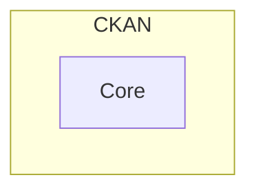
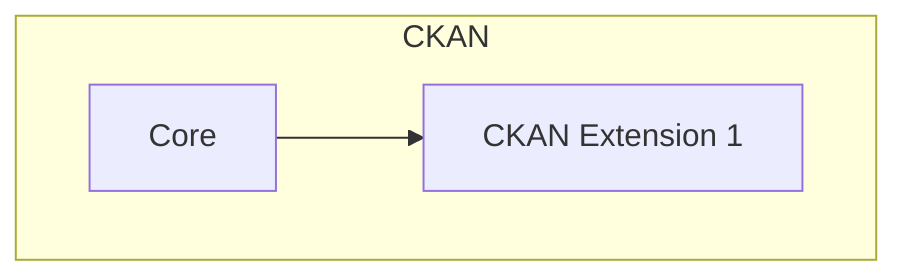
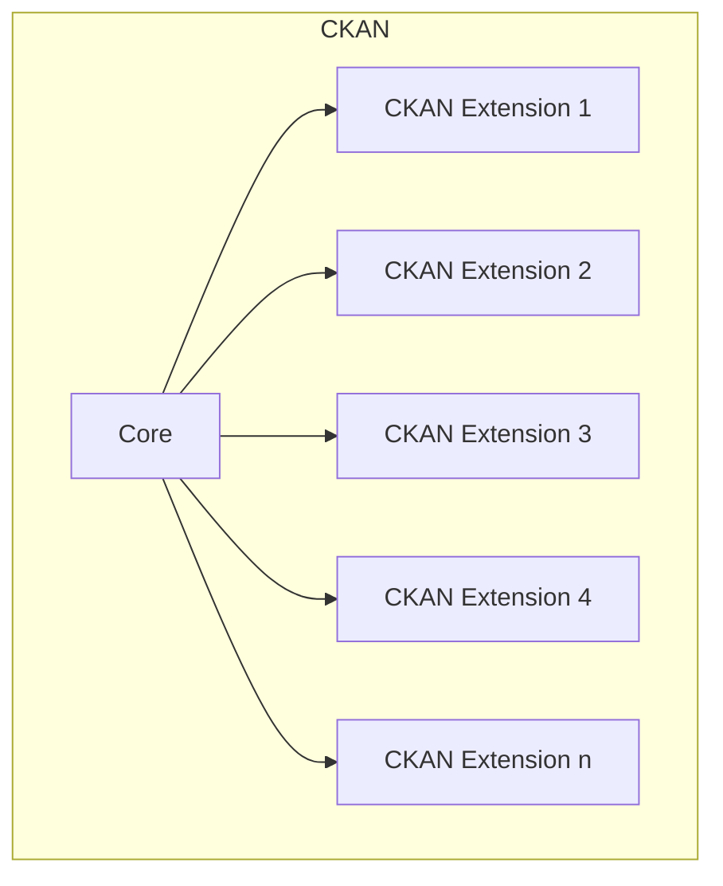
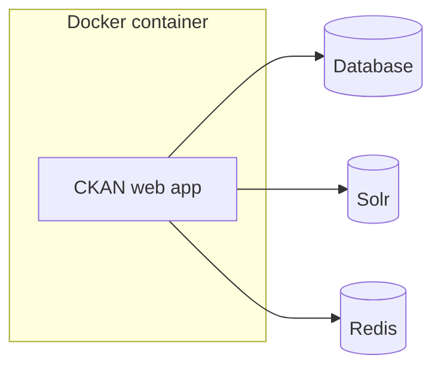
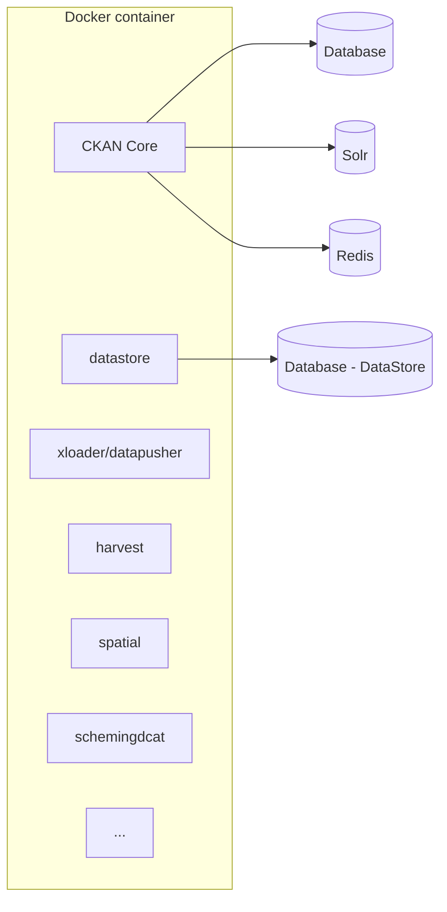
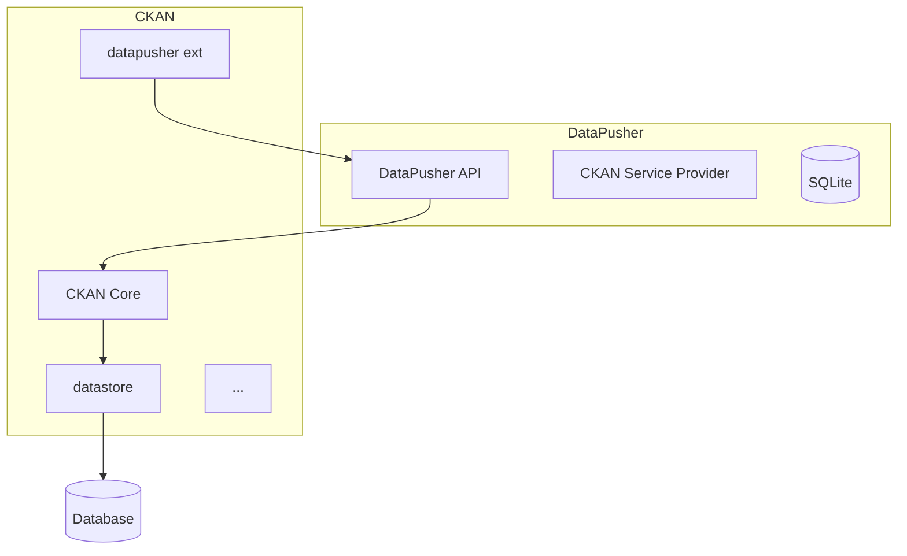

# Arquitectura CKAN

## Introducción

Este documento describe la arquitectura de CKAN [^1].

También encontrará cómo realizar tareas comunes como la tematización o las pruebas, en cada una de las arquitecturas.

## Arquitectura clásica de CKAN

Puedes ver un único proceso Python:

Cuando se quiere extender la funcionalidad del núcleo de CKAN, se desarrolla un paquete Python que debe ser instalado en CKAN. De esta manera, la extensión también se ejecutará en el mismo proceso que la funcionalidad del núcleo. Esto se conoce como arquitectura monolítica.

Cuando empiezas a añadir múltiples funcionalidades, a través de extensiones, lo que obtienes es un único proceso Python ejecutando muchas funcionalidades no relacionadas.

Este enfoque monolítico tiene ventajas en términos de simplicidad de desarrollo y despliegue, especialmente cuando el sistema es pequeño. Sin embargo, a medida que crece en escala y alcance, aumenta el número de problemas.

En este enfoque, una extensión opcional tiene la capacidad de colapsar toda la instancia de CKAN. Cada nueva extensión debe escribirse en el mismo lenguaje y *framework* (por ejemplo, [`python`](https://www.python.org/), aprovechando [`Flask`](https://flask.palletsprojects.com/)). Y, quizás lo más importante, el sistema en general está muy acoplado, lo que lo hace complejo y difícil de entender, depurar, ampliar y evolucionar.

### Arquitecturas
### CKAN
Este diagrama está basado en el fichero `docker-compose.yml` de [github.com/mjanez/ckan-docker](https://github.com/mjanez/ckan-docker) (`docker-compose.dev.yml` tiene los mismos componentes, pero diferente configuración).
 
Una diferencia de este diagrama al archivo es que no estamos incluyendo DataPusher, ya que no es una dependencia requerida.

ckan-docker](../../static/img/ckan-docker/ckan-docker-services.png)

>[!TIP]
> Las bases de datos pueden ejecutarse como contenedores Docker, o depender de servicios de terceros como Amazon Relational Database Service (RDS), Google Cloud Platform (GCP), etc.

Same setup showing some of the key extensions explicitly:

CKAN viene con varias extensiones incorporadas. Aquí, junto con la lista de componentes principales, listamos un par de ellas:

Nombre | Tipo | Dev | Repositorio | Descripción
-----|------|------------|------------|------------
CKAN | Aplicación (API + *Worker*) | | [Enlace](https://github.com/ckan/ckan) | Sistema de gestión de datos (DMS) para alimentar concentradores y portales de datos. Es una aplicación web monolítica que incluye varias extensiones y dependencias integradas, como un servicio de cola de trabajos. En teoría, es posible ejecutarlo sin ninguna extensión.
xloader | Extensión CKAN | | [Enlace](https://github.com/ckan/ckanext-xloader) | Un sustituto de DataPusher que ofrece diez veces más velocidad y más robustez.
datastore | Extensión CKAN | | [Enlace](https://github.com/ckan/ckan/tree/master/ckanext/datastore) | La interfaz entre CKAN y la base de datos de estructuras, la que recibe los conjuntos de datos y recursos (CSVs). Incluye una API para la base de datos y una interfaz de usuario administrativa.
harvest | Extensión CKAN | | [Enlace](https://github.com/ckan/ckanext-harvest) | Esta extensión proporciona un marco común de harvesting para extensiones CKAN y añade una CLI y WUI a CKAN para gestionar fuentes y trabajos de harvesting. Requiere la inclusión de recolectores personalizados de [ckanext-schemingdcat](https://github.com/mjanez/ckanext-schemingdcat?tab=readme-ov-file#harvesters).
geoview | Extensión CKAN | | [Enlace](https://github.com/ckan/ckanext-geoview) | Contiene plugins de visualización para mostrar archivos y servicios geoespaciales en CKAN. Contiene un visor basado en OpenLayers desarrollado originalmente por Philippe Duchesne y otros plugins de visualización que solían formar parte de ckanext-spatial.
spatial | Extensión CKAN | | [Enlace](https://github.com/ckan/ckanext-spatial) | Añade capacidades geoespaciales a CKAN, |
dcat | Extensión CKAN | ✔️ | [Enlace](https://github.com/mjanez/ckanext-dcat) | Desarrollo de un perfil para añadir el [Núcleo Español de Metadatos](https://datos.gob.es/es/doc-tags/nti-risp) con el objetivo de completar los elementos mínimos de metadatos incluidos en los conjuntos de datos actuales de acuerdo con [GeoDCAT-AP](https://semiceu.github.io/GeoDCAT-AP/releases/) e [INSPIRE](https://inspire.ec.europa.eu/about-inspire). |
scheming | Extensión CKAN | | [Enlace](https://github.com/mjanez/ckanext-scheming) | Proporciona una forma de configurar y compartir esquemas de metadatos utilizando una descripción de esquema YAML o JSON. Soporta validación personalizada y fragmentos de plantillas para edición y visualización.
resourcedictionary | Extensión CKAN | ✔️ | [Enlace](https://github.com/OpenDataGIS/ckanext-resourcedictionary) | Esta extensión amplía la funcionalidad predeterminada del diccionario de datos CKAN añadiendo la posibilidad de crear un diccionario de datos antes de cargar los datos en el almacén de datos. 
schemingdcat | Extensión CKAN | ✔️ | [Enlace](https://github.com/mjanez/ckanext-schemingdcat) | proporciona funciones y plantillas específicamente diseñadas para extender [ckanext-scheming](https://github.com/mjanez/ckanext-scheming) e incluye mejoras DCAT para adaptar el esquema CKAN a GeoDCAT-AP y varias mejoras como multilang para conjuntos de datos, orgs y grupos o nuevos temas.
fluent | Extensión CKAN | ✔️ | [Enlace](https://github.com/mjanez/ckanext-fluent) | Proporciona una forma de almacenar y devolver campos multilingües en conjuntos de datos, recursos, organizaciones y grupos CKAN. |
Base de datos | Base de datos || [Enlace](https://www.postgresql.org/) | La gente tiende a utilizar una única instancia de PostgreSQL para esto. Separada en múltiples bases de datos, es el lugar donde CKAN almacena su propia información (a veces denominada "MetaStore" y "HubStore"), filas de recursos (StructuredStore o DataStore), y conjuntos de datos y recursos en bruto ("BlobStore" o "FileStore"). Estos últimos pueden almacenar datos en el sistema de archivos local o en proveedores en la nube, mediante extensiones.
Solr | Base de datos | | [Enlace](https://solr.apache.org/) | Proporciona indexación y búsqueda de texto completo para CKAN.
Redis | Base de datos || [Enlace](https://redis.io/) | Almacén ligero de clave-valor, utilizado para almacenamiento en caché y colas de trabajo.
ckan-pycsw | Endpoint | ✔️ | [Enlace](https://github.com/mjanez/ckan-pycsw) | PyCSW Endpoint de Open Data Portal con docker compose config. Recolecta el catálogo CKAN en un endpoint CSW basado en conjuntos de datos espaciales existentes en el portal de datos abiertos. c     

## Glosario

### API

Una API HTTP, normalmente siguiendo el estilo REST.

### Aplicación

Un paquete Python, una API, un trabajador... Puede tener otras aplicaciones como dependencias.
  
### Extensión CKAN

Un paquete Python siguiendo las especificaciones de [CKAN Extending guide](https://docs.ckan.org/en/2.8/extensions/index.html).
  
### Base de datos

Una colección organizada de datos.

### Dataset

Un grupo de recursos hechos para ser distribuidos juntos.
  
### Frontend Theme

Un proyecto Node que especializa el comportamiento presente en [Frontend v2](https://github.com/datopian/frontend-v2).
  
### Recurso

Un blob de datos. Los formatos más comunes son CSV, JSON y PDF.
  
### Sistema

Grupo de aplicaciones y bases de datos que trabajan conjuntamente para realizar un conjunto de tareas.
  
### Trabajador

Aplicación que ejecuta tareas en segundo plano. Pueden ejecutarse de forma recurrente según una programación determinada, o tan pronto como lo solicite otra aplicación.

### Apéndice

### Arquitectura - CKAN con DataPusher

Nombre | Tipo | Repositorio | Descripción
-----|------|------------|------------
DataPusher | Sistema | [Enlace](https://github.com/ckan/datapusher) | Microservicio que analiza archivos de datos y los carga en el almacén de datos.
API DataPusher | API | [Enlace](https://github.com/ckan/datapusher) | API HTTP escrita en Flask. Se llama desde la extensión incorporada `datapusher` de CKAN cada vez que se crea un recurso (y tiene el tipo correcto).
CKAN Service Provider | Worker | [Enlace](https://github.com/ckan/ckan-service-provider) | Librería para hacer servicios web que pongan a disposición funciones como trabajos síncronos o asíncronos.
SQLite | Base de datos | Uso desconocido. Posiblemente una dependencia del *worker*.

[^1]: CKAN Code architecture. Official documentation. https://docs.ckan.org/en/latest/contributing/architecture.html